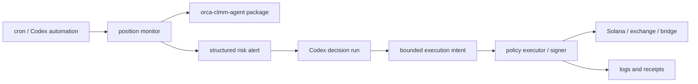

# Agentic Monitoring

This repository should stay focused on Orca Whirlpool concentrated liquidity.
The `package` directory exposes the reusable Orca CLMM module. The
`agent-runtime` image is the broader execution environment that consumes this
module and can also include clients for LI.FI, exchanges, bridges, or other
protocols.

## Scope Boundary

- Keep Orca position discovery, analysis, opening, and closing in the
  `orca-clmm-agent` package.
- Keep autonomous orchestration, Codex CLI, cross-platform clients, and
  operational tooling in `agent-runtime`.
- Keep real signing outside Codex in a policy-enforcing executor service.
- Add other platforms behind adapter interfaces only when there is a concrete
  position source or execution need.

This gives the project a clear open-source surface while still allowing the
runtime to become a more general agentic trading lab.

## Hooks vs Monitors

Codex CLI hooks are lifecycle scripts around the Codex agent loop. They are a
good fit for deterministic guardrails:

- scan prompts for leaked secrets before they reach the model
- block unsafe shell commands or transaction submission commands
- log prompts, tool calls, and final decisions
- validate that the final answer includes required fields
- continue a turn when tests, simulations, or policy checks were skipped

See [`codex-observability-hooks.md`](codex-observability-hooks.md) for the
repo-local hook recorder. It records sanitized Codex lifecycle events and helps
reconstruct what the agent saw and did, but it cannot expose private hidden
reasoning. Trading rationale must be written explicitly to the action log before
live execution.

Hooks are not the right place for continuous trading logic. They only run when
Codex is already active, and command hooks for the same event may run
concurrently. A market monitor needs an explicit schedule and a durable state
model.

Use a monitor or automation for position checks:

1. Wake on a fixed cadence, such as every few minutes.
2. Load positions through the Orca module.
3. Compute distance to lower and upper range edges.
4. Emit a structured alert when a threshold is crossed.
5. Ask Codex to decide whether to keep, close, rebalance, or move liquidity.
6. Send any execution intent to a separate signer or executor.

## Orca First

The first monitor should be Orca-only. Orca has enough pool depth and the local
package already models the core workflows. A practical trigger is:

```text
distance_to_lower_edge_pct <= threshold_pct
or distance_to_upper_edge_pct <= threshold_pct
or position_is_out_of_range
```

The threshold should be configurable. Five percent is a reasonable starting
point, but the monitor should also support pool-specific thresholds.

Useful snapshot fields:

- wallet and position mint
- pool address and token symbols
- current price and tick
- lower and upper ticks
- distance to each range edge
- in-range or out-of-range status
- liquidity, token balances, fees, and estimated close value
- recent price movement and pool liquidity context

## Cross-Platform Later

Long-term, the runtime can monitor more than Orca, but each platform should
enter through an adapter rather than bespoke prompts.

```ts
export interface PositionAdapter {
  readonly id: string;
  listPositions(): Promise<PositionSnapshot[]>;
  getRisk(position: PositionSnapshot): Promise<PositionRisk>;
}
```

LI.FI is useful for routing swaps and bridges, but it is not by itself a full
position inventory. For non-Orca assets, add adapters for the actual position
source: wallet balances, staking contracts, LP NFTs, CEX/DEX margin accounts,
or protocol-specific APIs.

## Recommended Runtime Flow



The executor is the only component that should hold hot credentials. Codex can
propose and simulate actions, but policy checks decide whether anything is
signed.
