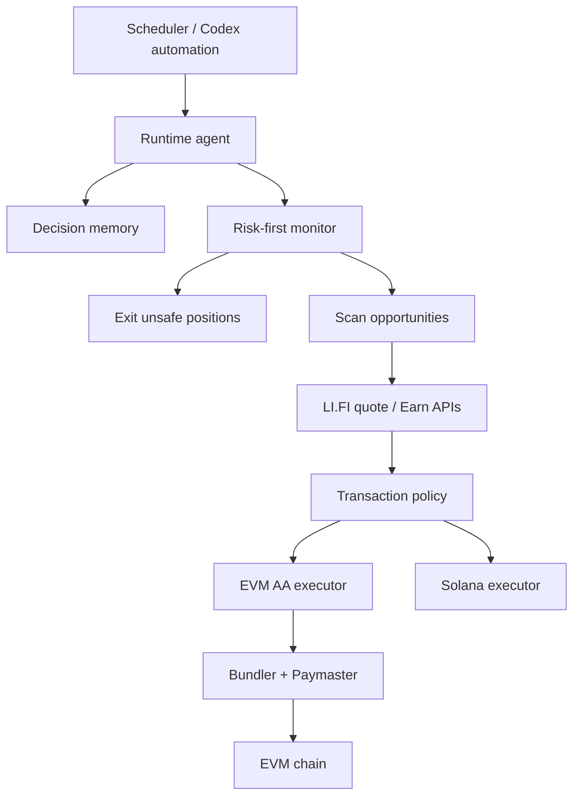

# Cross-Chain Gasless Runtime

The Orca package should stay Orca-specific. Cross-chain yield, bridges, and EVM
account abstraction belong in `agent-runtime`.

## What Gasless Means

Gasless EVM execution is not an AWS feature. It comes from ERC-4337 account
abstraction:

1. The agent owns or controls an EVM owner key.
2. A smart account is derived for each supported EVM chain.
3. The agent builds a UserOperation instead of a normal EOA transaction.
4. A bundler submits the UserOperation.
5. A paymaster sponsors gas if the operation passes its policy.

AWS Bedrock AgentCore can host this flow, but so can GCP Cloud Run, a local
Docker container, or any other runner. The platform-specific pieces are key
storage, scheduling, logs, and dashboards.

## Runtime Shape

## GCP Mapping

| AgentCore-style concern | GCP/local equivalent |
| --- | --- |
| AgentCore Runtime | Cloud Run Job or local Docker |
| EventBridge schedule | Cloud Scheduler |
| Secrets Manager | Google Secret Manager or mounted local secret |
| DynamoDB snapshots | Firestore, BigQuery, Cloud SQL, or local SQLite |
| AgentCore Memory | Postgres/SQLite plus embeddings or file-backed memory |
| Amplify dashboard | Cloud Run, Firebase Hosting, Vercel, or static dashboard |

## First Capabilities To Add

- EVM smart account discovery for selected chains.
- Pimlico bundler/paymaster configuration.
- LI.FI quote execution through the smart account.
- Risk-first cycle before scanning new yield.
- Structured JSONL logs for portfolio snapshots, risks, actions, and receipts.
- Optional dashboard over those logs.

## Risk Notes

- Paymaster sponsorship is policy-dependent. A quote can be valid while a
  UserOperation is not sponsored.
- ERC-20 routes may require allowances from the smart account.
- Cross-chain routes have bridge finality and route-status monitoring risk.
- Solana does not use ERC-4337. A Solana "gasless" path would be a sponsored
  fee-payer or relayer pattern, not the same EVM account-abstraction flow.
- Keep research and signing separated before scaling beyond a dev wallet.
